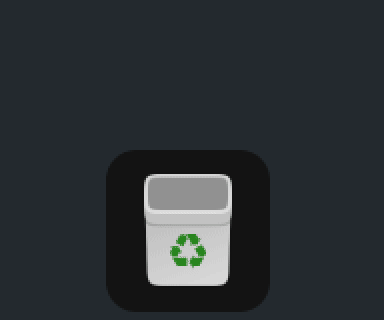
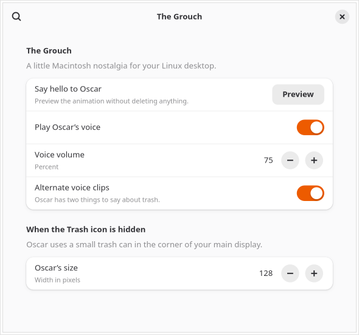

# The Grouch for GNOME

Oscar pops out of the dock's Trash icon when the Trash becomes empty, bringing
the classic Macintosh effect to GNOME. The watcher never moves, restores,
deletes, or empties files itself.



*Silent demo on GNOME 50.*

This repository contains the Linux code and the demo above. Original asset
files must be supplied locally; they are excluded from Git. See
[ATTRIBUTION.md](ATTRIBUTION.md).

## Requirements

- GNOME Shell 50; verified on Ubuntu 26.04 with GNOME Shell 50.1 and Ubuntu Dock.
- Git to download the repository; Python 3 and FFmpeg for importing locally supplied assets.
- PipeWire's `pw-play` for sound.
- GNOME's usual `gjs`, `glib-compile-schemas`, `gsettings`, and `gnome-extensions` tools.

This is a GNOME extension. Other distributions using GNOME 50 may work, but
have not been verified. KDE, Xfce, Cinnamon, and MATE are not supported.

## Install

Start by downloading this extension:

```sh
git clone https://github.com/adamirving92/gnome-grouch.git
cd gnome-grouch
```

Obtain a local copy of Charlie Robin's [version 2 source at commit
0d588d7f37fd7a58a2bd972d9ad2c68f97036858](https://github.com/charlierobin/oscar-the-grouch-version-2/tree/0d588d7f37fd7a58a2bd972d9ad2c68f97036858)
with the rights needed for your intended use. The importer does not download
anything or grant rights to those assets. Supply the directory containing its
`frames/` and `audio/` folders:

```sh
python3 tools/import-assets.py /path/to/oscar-the-grouch-version-2
./install.sh
```

The importer validates all 33 PNG frames, copies them unchanged, and mixes
the original audio stems at vocals 0.5 plus music 0.1. It writes only the local,
ignored `assets/` directory. To inspect an import elsewhere, pass
`--output-dir /path/to/local/assets`.

Installation copies the extension to your user extension directory, preserves
your enabled-extension list, and turns on GNOME's master switch for user
extensions. A newly installed extension usually requires logging out and back
in before GNOME can load it.

## Controls

Click the top-bar Trash indicator and choose **Preview Oscar** to see and hear
the animation without deleting anything. The menu also provides a sound toggle
and preferences for volume, alternating clips, and fallback size.



```sh
gnome-extensions prefs grouch@local
gnome-extensions disable grouch@local
gnome-extensions enable grouch@local
gnome-extensions uninstall grouch@local
```

## Nothing appeared?

After installing for the first time, log out and back in, then check:

```sh
gnome-extensions info grouch@local
```

The extension should show **Enabled: Yes** and **State: ACTIVE**. Open its
top-bar Trash menu and choose **Preview Oscar**. You can also open preferences
with `gnome-extensions prefs grouch@local` and click **Preview**.

If your desktop has disabled all user extensions, turn them back on in GNOME's
Extensions app, or run:

```sh
gsettings set org.gnome.shell disable-user-extensions false
```

If preview works but a hidden dock does not show Oscar at its Trash icon, look
in the bottom-right corner of your main display. For missing sound, check the
sound switch and voice volume in preferences, your system mute and audio output,
and whether `pw-play` is installed.

## Behavior and limitations

The extension reacts to a nonempty-to-empty transition in `trash:///`, including
trash locations exposed by GVfs. It does not play just because you log in or
check an already-empty Trash. Restoring its final item also produces that same
transition and triggers Oscar.

With a visible Ubuntu Dock or Dash to Dock Trash icon, the animation uses the
Mac version's original timing, scale, and positioning. If the icon is hidden,
clipped, unavailable, or too close to a display edge for the full animation,
Oscar appears with a small bin in a corner of your main display. With docks on
multiple displays, Oscar uses the first visible Trash icon with enough room,
which may differ from the dock used to empty the Trash. Dock integration uses
extension APIs that may change in future
versions. Other GNOME Shell versions are not supported by this release.

## Validation

Verified on Ubuntu 26.04 / GNOME Shell 50.1, including a live desktop preview,
trash transition detection, sound playback, disable/re-enable cleanup,
and preferences. Isolated GNOME sessions verified all four dock sides and
the screen-edge fallback with a top dock on a secondary display. The local
asset importer was checked against the pinned Mac source; all 33 PNG frames
remain byte-identical and the two WAV mixes use the original volume settings.

## License

[MIT](LICENSE) for the newly written Linux code, tools, configuration, and
documentation. The original character, artwork, and recordings, including
artwork visible in the demo GIF, are excluded from that license. Original asset
files are supplied locally and are not included here.
